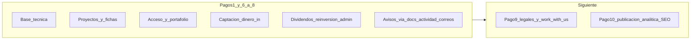

# Plan de trabajo — Plataforma de inversiones Golden State

Copia viva del plan de entregas mensuales (pagos 2–10). Actualizar este archivo en el repo cuando cambie el alcance o el orden.

Este documento resume **qué se acordó en la cotización**, **qué cubre el primer anticipo** (base del producto por detrás del sitio público) y **cómo organizamos el resto en nueve entregas mensuales** (pagos 2 a 10). La página **Quiénes somos** corresponde al **pago 2**. La **página de inicio** pública, **FAQ**, **contacto**, **navegación completa** e **idioma sugerido por ubicación** corresponden al **pago 3**. El **pago 10** agrupa **analítica** (p. ej. Google Analytics), **métricas**, **SEO** y **metadatos para redes**, junto con el **cierre de publicación** del sitio.

El precio total y la forma de pago que firmamos no cambian: lo que sigue es **cómo repartimos el alcance** en esas nueve entregas.

---

## Lo que contempla el proyecto (recordatorio)

Según lo acordado, la plataforma debe permitir que los inversionistas:

- conozcan el modelo y los proyectos disponibles;
- consulten el avance de cada proyecto;
- tengan un **tablero personal** con su portafolio;
- reciban **actualizaciones** y, en su momento, vean **pagos / historial** y opciones ligadas a **reinvertir**.

Y el equipo administrativo debe poder:

- crear y editar proyectos, con imágenes y documentos, **estado** y **porcentaje de avance**;
- administrar inversionistas, **asignar proyectos**, ver portafolios y **ajustar montos** cuando corresponda;
- **notificar** sobre cambios o avances.

Además: los depósitos se registran **por transferencia bancaria** y la **confirmación es manual** (sin pasarela de pago en línea).

---

## Lo que ya quedó cubierto (equivale al primer pago)

El **primer pago** cubrió la **base del producto** en código: pantallas recorribles, APIs y base de datos. **Todas estas piezas siguen abiertas a refinamiento** según feedback del cliente (copy, flujo, diseño y prioridades); el **pago 2** incluye explícitamente **pulido** de lo existente.

### Inventario alineado con el repositorio actual

**Público / inversionista**

- **Listado de proyectos** (`/projects`) — galería alimentada por base de datos.
- **Ficha de propiedad / proyecto** (`/properties/[id]`) — detalle por `investmentId`.
- **Registro** (`/register`) — alta con correo/contraseña o Google; cuestionario en **completar perfil** (**pago 4**, en curso).
- **Inicio de sesión** — NextAuth (credenciales y Google); reglas por estado de cuenta (`PENDING_EMAIL`, `PENDING_ADMIN`, `ACTIVE`, `REJECTED`).
- **Onboarding inversionista** — verificar correo, completar perfil, pendiente de aprobación, cuenta rechazada (**pago 4**, mayormente hecho).
- **Tablero del inversionista** (`/dashboard`) — entrada al área privada (activos aprobados).
- **Portafolio** (`/dashboard/portfolio`) — listado de inversiones del usuario (gated).
- **Mi cuenta** (`/dashboard/account`) — perfil, seguridad, estado de acreditación (**pago 4**, pendiente).
- **Flujo invertir / acreditación** — desde ficha de proyecto y desde Mi cuenta (**pago 4**, parcial).
- **Inicio del sitio** (`/`) bajo `/{locale}` — contenido en plantilla; la **landing definitiva** y el resto de **sitio informativo** van en **pagos 2 y 3** según este calendario.

**Administración**

- **Usuarios / inversionistas** — alta, edición, **aprobación o rechazo de cuenta**, **revisión de documentos de acreditación** (**pago 4**).
- **Propiedades / proyectos** — alta, edición y baja desde el panel admin + API (imágenes hoy como URLs en formulario; archivos reales en **pago 6**).
- **Vista de datos** (`/admin/data`) — resumen legible de propiedades, usuarios e inversiones existentes en BD (el rediseño admin y las **distribuciones** quedaron en **pago 7**).
- **Esquema / documentación interna** (`/admin/schema`) — referencia del modelo de datos para el equipo.

**Detrás de escena**

- **PostgreSQL + Prisma** — modelos `User`, `Property`, `Investment` y relaciones.
- Rutas API de **registro**, **verificación de correo**, **perfil inversionista**, **acreditación**, **admin/usuarios** y **admin/propiedades**.

**Qué todavía no hay como producto (y está en pagos posteriores del plan)**

- **Quiénes somos**, **FAQ**, **contacto**, **navegación cerrada** en menú/pie, enlaces huérfanos — **pagos 2 y 3** (según calendario original; varias ya entregadas).
- Páginas **legales** completas y **Trabaja con nosotros** — **pago 9**.
La página **Quiénes somos** se entrega en el **pago 2**. La **landing principal** (inicio del sitio público, cotizada en la Fase 1) **aún no forma parte de lo recibido**: va en el **pago 3**, junto con **FAQ**, **contacto** y el cierre de **navegación**; allí también va **idioma sugerido por ubicación**. **Analítica, métricas y el paquete SEO / redes para el lanzamiento** se entregan en el **pago 10**, con el cierre de **publicación** del sitio.

En conjunto: ya existe la **base técnica** y el recorrido de proyectos y panel; falta el **sitio informativo completo** (incluida la home pública), el resto de la **Fase 1** en la página y, más adelante, lo de la cotización como **producto terminado** y **operación diaria**.

---

## Qué es lo que aún falta (resumen claro)

El **inventario superior** ya refleja lo construido; puede **cambiar de forma y prioridad** con el cliente. Lo que sigue es lo que **aún no cierra** el alcance de la cotización u ordena los siguientes pagos:

- **Quiénes somos:** página **About** pública, **en español e inglés** (**pago 2**).
- **Página de inicio (landing):** primera versión en el entorno acordado, con contenido y línea visual de Golden State, **bilingüe** (**pago 3**).
- **FAQ, contacto y navegación:** enlaces del **menú y pie** sin rutas rotas, sección de **preguntas frecuentes** y **formulario de contacto** (**pago 3**). **Proyectos terminados vs en desarrollo** (filtros o secciones) también en el **pago 3**, junto con lo anterior.
- **Pulido de lo ya construido** (proyectos, detalle, registro, tablero, portafolio, admin): **pago 2**.
- **Base de implementación:** alinear el front con **shadcn**, **Magic MCP** y las **reglas de Cursor** del proyecto (**pago 2**).
- **Idioma (por ubicación):** además de la selección manual que ya existe, el comportamiento de **idioma sugerido según ubicación** (**pago 3**, junto con la landing).
- **Publicación, analítica y visibilidad en buscadores y redes:** **Google Analytics** u otra herramienta de **métricas**, **títulos y descripción**, **SEO** y **vista al compartir** en redes, en el marco del **cierre de publicación** (**pago 10**).
- **Registro y acceso:** formulario, verificación por correo, aprobación del administrador, **Mi cuenta** (perfil, contraseña, acreditación), correos transaccionales — **pago 4** (ver detalle en [PAGO_4_PLAN.md](PAGO_4_PLAN.md)).
- **Seguimiento del proyecto:** **estado** (planeación, desarrollo, completado), **porcentaje de avance** y **fechas** visibles para el inversionista.
- **Archivos reales:** subida de **documentos** (no solo textos en formulario) y **descargas** seguras desde el portafolio o la ficha del proyecto.
- **Operación de inversiones:** desde el admin, **asignar** un proyecto a un inversionista y **registrar o editar montos** sin depender solo de datos de prueba.
- **Depósitos:** flujo de “**avisé mi depósito**” y **confirmación manual por el admin**.
- **Roles extra** (contador, moderador) con permisos distintos, si se mantienen en el alcance; puede programarse al final o como extensión.

---

## Calendario sugerido: nueve entregas mensuales (pagos 2 a 10)

Cada bloque está pensado para **un mes y un pago**, en el orden que permite ir construyendo sin bloqueos técnicos.

### Pago 2 — Quiénes somos, pulido de lo existente y base de arquitectura

**Qué entregamos (lado cliente / producto)**

- **Quiénes somos:** página **About** acorde a la cotización, **en español e inglés**, con ruta enlazada desde el menú y el pie (p. ej. `/about`).
- **Afinado de pantallas que ya existen:** revisión de UX/UI y consistencia en páginas como **proyectos**, **detalle de propiedad**, **registro**, **tablero**, **portafolio** y **admin**, sin abrir todavía funcionalidades grandes de fases posteriores.

**Trabajo técnico (equipo de desarrollo)**

- **Arquitectura del proyecto:** repaso y ajuste de la estructura del front para que lo nuevo y lo retocado sigan un mismo criterio (componentes, carpetas, patrones de datos y estilos).
- **Herramientas actuales del equipo:** uso de **shadcn** y referencias **Magic MCP** según las **reglas de Cursor** vigentes del proyecto (las que no existían al arranque de este repo), de forma que el código quede alineado con ese estándar antes de seguir construyendo pantallas grandes.
- Plan operativo detallado (fases, checklist, definición de hecho): [FASE_2_ARQUITECTURA_SHADCN.md](FASE_2_ARQUITECTURA_SHADCN.md).

**Qué verán ustedes**

La sección **Quiénes somos** ya publicada y las pantallas existentes **más consistentes**. **FAQ**, **contacto**, **landing**, **resto de enlaces del sitio** y **terminados / en desarrollo** forman parte del **pago 3**.

---

### Pago 3 — Landing, FAQ, contacto, navegación e idioma

**Qué entregamos**

- **Página de inicio:** la **primera versión** de la landing principal que ustedes verán en la web pública, alineada a la cotización (captación, mensaje claro del modelo, llamados a la acción), **en español e inglés**, publicada bajo `/{idioma}` en el entorno en vivo acordado.
- **Preguntas frecuentes (FAQ)** y **Contacto** con formulario (aviso por correo o guardado en sistema según lo definamos), **bilingües**.
- **Enlaces y rutas:** el resto de enlaces del **menú y pie** que sigan pendientes (páginas reales o redirecciones acordadas) quedan **operativos**, sin rutas rotas.
- **Proyectos terminados vs en desarrollo:** filtros, pestañas o secciones en el listado público, cuando aplique.
- **Idioma inicial según ubicación** (respetando la elección manual del visitante).

**Qué verán ustedes**

**Home** pública, secciones de **FAQ** y **contacto**, **sitio navegable en conjunto** con **Quiénes somos** ya entregado, y comportamiento **bilingüe con sugerencia por ubicación**, según lo prometido en la cotización.

---

### Pago 4 — Registro, activación e inversionista acreditado

**Estado:** en curso. Plan técnico detallado: [PAGO_4_PLAN.md](PAGO_4_PLAN.md).

**Qué entregamos**

- Registro **completo** (correo/contraseña y Google): validaciones, mensajes claros, experiencia bilingüe (EN/ES).
- Flujo de **activación**: verificar correo → completar cuestionario de perfil → **aprobación del administrador** antes del tablero y portafolio.
- Páginas de estado: correo pendiente, perfil incompleto, **cuenta en revisión**, **cuenta no aprobada** (sin motivo; enlace a contacto).
- **Correos transaccionales** con marca: verificación, restablecer contraseña, cuenta aprobada; aviso al admin cuando un perfil queda pendiente.
- **Tablero y portafolio** accesibles solo para cuentas `ACTIVE`; protección en middleware y navegación.
- **Inversionista acreditado:** subida de documentos y autocertificación; revisión en panel admin; dos puntos de entrada:
  - **Invertir** en la ficha de un proyecto.
  - **Mi cuenta** → iniciar o consultar el proceso de acreditación.
- **Mi cuenta** (`/dashboard/account`): datos básicos editables, cambio de contraseña (usuarios con credenciales), estado y documentos de acreditación.
- Recuperación de contraseña (olvidé / restablecer) para usuarios no autenticados.

**Qué ya está hecho (resumen)**

- Onboarding completo, rechazo de cuenta, correos principales, OAuth Google, flujo de inversión desde proyecto (subida de docs), revisión admin de cuenta y acreditación, sincronización de sesión en tiempo real.

**Qué falta para cerrar el pago 4**

- Pantalla **Mi cuenta** y APIs de perfil / cambio de contraseña.
- Página de acreditación **desde Mi cuenta** (formulario compartido con el flujo por proyecto).
- Enlaces en tablero y menú; pulido de estados de **Invertir** según `accreditedStatus`.
- QA en staging y despliegue de migraciones.

**Qué queda para pagos posteriores (no es pago 4)**

| Tema | Pago |
|------|------|
| Almacenamiento seguro de documentos y descargas firmadas | 6 (cerrado) |
| Avance % y estado de proyectos en fichas y portafolio | 5 |
| Captación: reunión, depósito bancario entrante y confirmación (dinero in) | 6 (cerrado) |
| Distribuciones/dividendos, reinversión y rediseño admin (dinero out) | 7 (cerrado) |
| Avisos de avances (docs, actividad, correos; sin inbox dedicado) | 8 (cerrado) |
| Páginas legales y Trabaja con nosotros | 9 |

**Qué verán ustedes**

Un proceso de alta e ingreso **confiable**, un área **Mi cuenta** para gestionar lo esencial, y un camino claro para convertirse en **inversionista acreditado** antes de operar con dinero (captación en **pago 6**; pagos al inversionista en **pago 7**).

---

### Pago 5 — Estado y avance de cada proyecto

**Qué entregamos**

- En cada proyecto: **estado** (planeación, en desarrollo, completado), **porcentaje de avance** y **fechas** relevantes.
- El administrador podrá actualizar estos datos; el inversionista los verá en la **ficha del proyecto** y en su **portafolio** cuando corresponda.
- Listados públicos que permitan distinguir **terminados** y **en curso**.

**Qué verán ustedes**

Cumplimiento directo de la promesa: **“consultar el progreso de los proyectos”**.

---

### Pago 6 — Archivos reales + captación de capital (dinero in)

**Qué entregamos**

- Posibilidad de **subir archivos** (imágenes y documentos) desde el panel administrativo.
- Enlaces de **descarga seguros** para inversionistas con derecho a esa información (por ejemplo desde el portafolio o la ficha del proyecto).
- Flujo operativo de **captación**: solicitud de reunión, declaración de depósito bancario por el inversionista y **confirmación manual** por el admin (**sin** pasarela de pago en línea), con creación de aportes / portafolio.

**Qué verán ustedes**

Material de proyecto disponible de forma controlada, y el **núcleo de entrada de capital** validado manualmente por operaciones.

---

### Pago 7 — Pagos al inversionista, reinversión y rediseño del admin

**Estado:** completado.

**Qué entregamos**

- **Rediseño del panel administrativo** (navegación, layout y consistencia de las herramientas de ops).
- Registro de **distribuciones, dividendos o pagos** asociados a cada inversión (monto, fecha, concepto) — dinero **hacia el cliente**.
- Pantallas para que el inversionista vea **historial** y resúmenes (sustituye el placeholder de returns).
- **Primera versión de reinversión**: solicitud del inversionista, reserva en billetera y cola admin para confirmar o rechazar. Incluye **retiro** (cash-out) con el mismo patrón.

**Qué verán ustedes**

Ops con un admin más usable, y transparencia en **resultados / pagos recibidos**, con punto de partida para **reinvertir**.

---

### Pago 8 — Notificaciones de avances

**Estado:** completado (cierre pragmático). No hay un centro de notificaciones dedicado ni avisos push al subir un documento de avance; se cierra el pago con las superficies ya en producto.

**Qué cuenta como entregado**

- **Documentos de avance** por proyecto (admin sube; inversionistas con holding descargan desde el portafolio).
- **Actividad** del inversionista (`/dashboard/activity`) para solicitudes de inversión y movimientos de billetera.
- **Correos transaccionales** de onboarding, acreditación, reunión y aviso de depósito (ops).

Un inbox de “novedades de proyecto” con publicación masiva y correo al holder queda fuera de este pago (evolución futura, no pago 9 ni 10).

---

### Pago 9 — Páginas legales y Trabaja con nosotros

**Qué entregamos**

- Páginas **legales** bilingües (p. ej. términos de servicio, política de privacidad, avisos / disclaimers) enlazadas desde el pie y los flujos de registro.
- Página **Trabaja con nosotros / Work with us** (u oportunidad de colaboración) como superficie estática de marca.
- Integración en **navegación / pie** sin enlaces rotos.

**Qué verán ustedes**

Sitio institucional completo en lo legal y de talento/colaboración, no solo el producto de inversión.

---

### Pago 10 — Publicación del sitio, analítica y métricas

**Qué entregamos**

- **Google Analytics** (GA4 u otra analítica acordada), configurada para medir visitas y comportamiento en la **publicación** del sitio.
- Cualquier otro **tag o panel de métricas** que acordemos para ese mismo cierre de **lanzamiento**.
- Ajustes finales de **títulos, descripción, SEO** y **vista al compartir en redes** (Open Graph, etc.) alineados a la **salida oficial** del producto.
- Revisión breve de **checklist de publicación** (entorno de producción, dominio, etc.) en la medida que corresponda al contrato.

**Qué verán ustedes**

El sitio **medible** para el público y **presentado de forma profesional** en buscadores y redes, en el momento en que el proyecto se considera **publicado**, después de cerrar las funcionalidades de los pagos anteriores.

---

## Opcional (alcance adicional o mes siguiente)

- **Roles de contador y moderador** con permisos distintos al administrador principal, si se mantienen en el contrato y se reserva tiempo o presupuesto.

---

## Cómo se agrupan las entregas (visión por etapas de la cotización original)

- **Pagos 2 y 3:** **Fase 1** en sitio visible (**pago 2:** **Quiénes somos**, pulido de lo existente, base shadcn/Magic/reglas Cursor; **pago 3:** landing, **FAQ**, **contacto**, menú y pie **sin enlaces rotos**, terminados/en desarrollo, idioma por ubicación).
- **Pagos 4 a 6:** núcleo de la **Fase 2** (acceso seguro, **Mi cuenta y acreditación**, avance de proyectos, archivos, **captación** de inversiones y depósitos entrantes).
- **Pago 7 (cerrado):** **visibilidad financiera saliente** (dividendos / historial / reinversión) + **rediseño del admin**.
- **Pago 8 (cerrado):** **comunicación** de avances vía documentos, actividad y correos transaccionales (sin inbox dedicado).
- **Pago 9:** **páginas estáticas** legales y Trabaja con nosotros.
- **Pago 10:** **cotización / extensión de Fase 1** en su parte de **analítica**: mediciones y metadatos de **lanzamiento**, junto con el cierre orientado a **publicación**.

---

## Nota comercial breve

La cotización original describía dos fases grandes y un calendario distinto; el acuerdo actual (**diez pagos**) es una **forma de pago** para facilitar el flujo de caja. Este plan **no sustituye el contrato ni el monto cerrado**; solo ordena el trabajo pendiente para que mes a mes haya entregas claras y verificables.

Si desean, en la siguiente reunión podemos **marcar con fecha** cada pago 2–10 o ajustar el orden de un mes según prioridad de negocio, siempre que no rompa dependencias (por ejemplo, el registro sólido antes de flujos sensibles de dinero).

